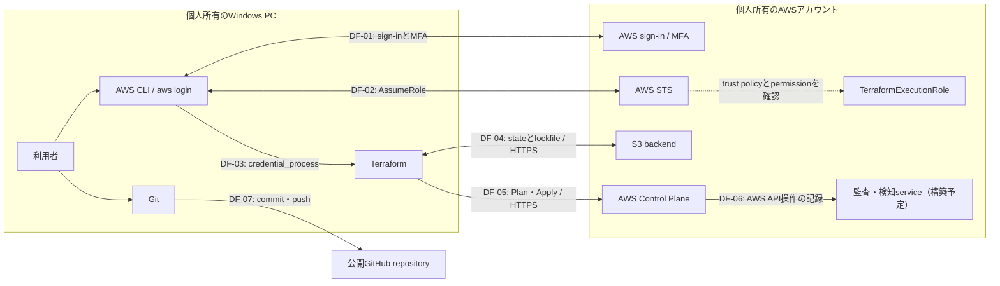

# Terraform AWS Security Baseline セキュリティ設計・Threat Model

- 状態: 策定中
- 制定日: 2026-08-27
- 対象: 個人所有の単一AWSアカウント、dev環境、ap-northeast-1

## 1. 目的

本プロジェクトは、将来、別のsystemを許可された利用者が
外部networkから安全に閲覧・操作できるAWS環境を構築するための
学習・検証環境とする。

その前提として、AWS resourceをTerraformで再現可能に管理し、
各security controlがどのriskを抑えるのか確認しながら基盤を構築する。

## 2. 守る資産

### A-01: AWS Identityと認証情報

AWS root user、Terraform日常実行用IAM user、TerraformExecutionRole、
MFAおよび`aws login`で取得する一時認証情報を保護対象とする。

これらが侵害されると、権限の範囲内でAWS resourceの参照、変更、削除、
新規作成が行われ、情報漏えい、security controlの無効化、
監査ログの改ざん、想定外の課金につながる可能性がある。

長期access keyを使用しない構成であっても、
有効期限内の一時認証情報が漏えいすれば悪用される可能性があるため、
認証情報をGit、Terraformコード、作業記録へ保存しない。

### A-02: Terraform state

Terraform stateは、Terraformコードと実際のAWS resourceを対応付けるための
管理情報であり、重要な保護対象とする。

stateにはresource ID、ARN、設定値などが記録され、
resourceによっては通知先メールアドレスなどの個人情報や
sensitiveな値が含まれる可能性がある。

stateが漏えいするとAWS環境の構成を第三者に把握される可能性があり、
改ざんまたは削除されると、Terraformが実際のAWS resourceを正しく管理できず、
意図しない作成、変更、削除につながる可能性がある。

そのため、stateはGitへ保存せず、公開を禁止したS3 backendで管理し、
暗号化、versioning、IAMによるaccess制御、HTTPS必須、
S3 lockfileによる同時更新防止を適用する。

### A-03: Terraformコードと設計文書

Terraformコード、変数定義、Provider・backend設定、ADRおよび各設計文書を、
AWS環境を再現し、変更理由を確認するための保護対象とする。

これらが意図せず変更されると、過剰なIAM permission、S3の公開、
loggingの停止、resourceの削除などがTerraform Planへ混入する可能性がある。

そのため、変更はGitで履歴管理し、Apply前に差分、`terraform fmt`、
`terraform validate`、`terraform plan`を確認する。
認証情報、個人情報、`terraform.tfvars`およびstateはGitへ保存しない。

### A-04: 監査ログと検知情報

CloudTrailのAWS操作履歴、AWS Configの構成変更履歴、
GuardDutyおよびSecurity Hubの検知結果を保護対象とする。

これらは、いつ、誰が、どのresourceへ何を行ったか、
どのような不審な動作や設定不備が検知されたかを確認するための情報である。

ログの記録が停止された場合や、保存された情報が削除・改ざんされた場合、
security incidentの発生範囲、原因、影響を正しく調査できなくなる。

そのため、記録の有効化だけでなく、保存先の非公開化、暗号化、
access制御、保持期間および監視停止の検知を設計する。

### A-05: AWS resourceとsecurity設定

IAM Role・Policy、S3 bucket、AWS Budgetおよび、
今後構築する監査・検知serviceの設定を保護対象とする。

これらは、access制御、stateの保護、費用の監視、
AWS操作の記録および異常の検知を実現するためのresourceである。

設定が許可なく変更または削除されると、権限の拡大、stateの漏えい・消失、
監査の停止、異常の見逃し、想定外の課金につながる可能性がある。

そのため、原則としてTerraformで管理し、
Apply前にPlanを確認する。
AWS Consoleで手動変更した場合は、変更理由を記録し、
必要な変更をTerraformコードにも反映する。

## 3. Threat Modelの対象範囲

### 3.1 対象に含めるもの

- 個人所有のWindows PCから`aws login`で認証し、
  IAM userからTerraformExecutionRoleを引き受けてTerraformを実行する経路
- 公開GitHub repositoryおよびローカル環境で管理するTerraformコードと設計文書
- 個人所有の単一AWSアカウント、dev環境、`ap-northeast-1`のAWS resource
- Terraform stateを保存するS3 backendと、stateを読み書きする通信経路
- AWS Budgetおよび本プロジェクトで構築予定のIAM、監査、検知に関するresource

### 3.2 対象に含めないもの

- 将来接続する別systemのapplication、business data、
  利用者認証・認可および外部networkからのaccess経路
- `stg`・`prod`環境、複数AWSアカウントおよびAWS Organizations
- HCP TerraformやCI/CDによるTerraformの自動実行、承認およびチーム権限管理
- 24時間体制の監視、security incidentへの完全自動対応
- AWSが管理するdata center、物理設備および基盤software

## 4. Trust Boundary

Trust Boundaryとは、管理主体または信頼条件が異なる領域の境界を指す。
境界を越える通信や操作について、認証、認可、暗号化および記録を確認する。

### TB-01: Windows PCとAWS認証の境界

個人所有のWindows PCは、AWSアカウントの外部に存在する。
利用者はInternet経由で`aws login`を実行し、
AWSのsign-inとMFAを経て一時認証情報を取得する。

この境界では、偽のsign-in画面による認証情報の窃取、
第三者によるなりすまし、PC内の一時認証情報の窃取を脅威として扱う。

対策として、root userとIAM userへのMFA、長期access keyの不使用、
有効期限のある一時認証情報およびHTTPS通信を使用する。

### TB-02: IAM userとTerraformExecutionRoleの境界

`aws login`で認証したIAM userは、
TerraformExecutionRoleを引き受けるためにAWS STSへ`AssumeRole`を要求する。

AWSは、IAM user側に`sts:AssumeRole`の許可があることと、
Roleのtrust policyがそのIAM userを信頼していることの両方を確認する。
両方が成立した場合に、Role用の一時認証情報が発行される。

この境界では、trust policyの対象が広すぎること、
IAM userが不要なRoleを引き受けられること、
TerraformExecutionRoleへ過剰なpermissionが設定されることを脅威として扱う。

対策として、Roleを引き受けられるPrincipalを対象のIAM userに限定し、
IAM userが引き受けられるRoleと、
TerraformExecutionRoleが操作できるAWS resourceを必要最小限にする。
`AssumeRole`とRoleによるAWS操作はCloudTrailで記録する。

### TB-03: TerraformとS3 backendの境界

ローカルPC上のTerraformは、TerraformExecutionRoleの一時認証情報を使用し、
Internet経由のHTTPS通信でS3 backendへ接続する。

Terraformは、dev環境のstate objectを読み書きし、
Terraform実行中は同じ保存先にS3 lockfileを一時的に作成する。

この境界では、権限のない利用者によるstateの読み取り・書き換え・削除、
誤ったbucketまたはobject keyへの保存、
複数のTerraform実行によるstateの競合を脅威として扱う。

対策として、S3 bucketの公開を禁止し、SSE-S3による保存時暗号化、
HTTPS必須、versioning、object単位のIAM permission、
S3 lockfileによる同時更新防止を適用する。

### TB-04: TerraformとAWS Control Planeの境界

TerraformはAWS Providerを介して各AWS serviceのAPIへ接続し、
AWS resourceの現在の状態を読み取り、作成・変更・削除を要求する。

この境界では、誤ったTerraformコード、意図しないApply、
改ざんされたProvider、過剰なRole permissionによる
AWS resourceの不正な作成・変更・削除を脅威として扱う。

対策として、AWS Providerのversionとchecksumを
`.terraform.lock.hcl`で固定する。
Apply前に`terraform fmt`、`terraform validate`、
`terraform plan`と変更差分を確認し、利用者が手動で承認する。

TerraformExecutionRoleのpermissionを必要最小限にし、
AWS APIへの通信にはHTTPSを使用する。
実行されたAWS API操作はCloudTrailで記録する。

### TB-05: ローカル環境と公開GitHub repositoryの境界

ローカル環境で作成したTerraformコードと設計文書は、
Gitでcommitされ、認証された暗号化通信を通じて
公開GitHub repositoryへpushされる。

この境界では、認証情報、個人情報、Terraform state、
`terraform.tfvars`などを誤って公開すること、
第三者によるrepositoryの不正変更を脅威として扱う。

対策として、公開できないファイルを`.gitignore`で除外し、
commit前に`git status`、`git diff`およびstaging内容を確認する。
認証情報や個人情報をTerraformコードと作業記録へ記載しない。

一度公開した情報はGitの履歴や外部のcacheへ残る可能性があるため、
削除すれば完全に非公開へ戻せるとは考えない。
認証情報を誤って公開した場合は、その認証情報を失効または更新する。

## 5. Data Flow

## 6. 脅威の分析方法

本プロジェクトでは、Threat Modelの分類方法としてSTRIDEを使用する。

| 分類 | 名称 | 本プロジェクトでの例 |
|---|---|---|
| S | Spoofing（なりすまし） | 盗まれた一時認証情報を使用して正規利用者になりすます |
| T | Tampering（改ざん） | Terraformコード、state、IAM Policyまたは監査ログを書き換える |
| R | Repudiation（否認） | 操作記録がなく、実行者が自分の操作ではないと主張する |
| I | Information Disclosure（情報漏えい） | state、認証情報または個人情報が公開される |
| D | Denial of Service（利用妨害） | stateやAWS resourceが使用不能になり、Terraformを実行できなくする |
| E | Elevation of Privilege（権限昇格） | IAM設定の不備を利用して、本来許可されていない権限を取得する |

各脅威について、脅威ID、関連する資産、Trust BoundaryまたはData Flow、
攻撃・事故の内容、影響、既存対策、追加対策および残存riskを記録する。

## 7. Risk評価方法

### 7.1 発生可能性

| 値 | 評価 | 基準 |
|---|---|---|
| 1 | 低 | 特殊な条件が必要で、通常の運用では発生しにくい |
| 2 | 中 | 一定の条件がそろえば発生する可能性がある |
| 3 | 高 | 攻撃または操作ミスによって容易に発生する可能性がある |

### 7.2 影響度

| 値 | 評価 | 基準 |
|---|---|---|
| 1 | 低 | 影響が限定的で、容易に復旧できる |
| 2 | 中 | AWS resourceの変更や一時的な管理不能が発生し、復旧作業が必要になる |
| 3 | 高 | AWSアカウント、認証情報、stateまたは監査記録が侵害され、重大な漏えい・破壊・課金につながる |

### 7.3 Risk score

Risk scoreは、発生可能性と影響度を掛け合わせて算出する。

`Risk score = 発生可能性 × 影響度`

| Risk score | 優先度 |
|---|---|
| 1〜2 | 低 |
| 3〜4 | 中 |
| 6〜9 | 高 |

各脅威について、次の3段階でriskを記録する。

- 固有risk: security controlを考慮しない状態のrisk
- 現在の残存risk: 現在までに実装・確認済みのcontrolを考慮したrisk
- 目標残存risk: 追加予定のcontrolが実装・確認された後に想定するrisk

予定しているだけのcontrolは、現在の残存riskを下げる根拠に含めない。

## 8. 脅威シナリオ

### TH-01: 一時認証情報の窃取となりすまし

| 項目 | 内容 |
|---|---|
| STRIDE | S: Spoofing |
| 関連資産 | A-01、A-02、A-05 |
| 関連境界 | TB-01、TB-02 |
| 関連Data Flow | DF-01、DF-02、DF-03 |
| シナリオ | phishingやPCの侵害により、有効期限内のIAM userまたはTerraformExecutionRoleの一時認証情報が盗まれ、第三者が正規利用者としてAWS APIを実行する |
| 影響 | Roleのpermission範囲内で、stateの読み書き、AWS resourceやsecurity設定の変更、想定外のresource作成が行われる可能性がある |
| 既存control | root userとIAM userへのMFA、長期access keyの不使用、`aws login`による一時認証情報、IAM userとTerraformExecutionRoleの分離、Role permissionのresource制限 |
| 追加予定control | CloudTrailによる操作記録、GuardDutyによる不審な認証情報利用の検知、IAM permissionの定期確認 |
| 固有risk | 発生可能性3 × 影響度3 = 9（高） |
| 現在の残存risk | 発生可能性2 × 影響度3 = 6（高） |
| 目標残存risk | 発生可能性2 × 影響度2 = 4（中） |
| 残存risk | 有効期限内の一時認証情報が盗まれた場合、失効または期限切れになるまで悪用される可能性が残る。GuardDutyもすべての不正利用を必ず検知できるわけではない |

### TH-02: Terraform stateの改ざん・削除

| 項目 | 内容 |
|---|---|
| STRIDE | T: Tampering、D: Denial of Service |
| 関連資産 | A-02、A-05 |
| 関連境界 | TB-03 |
| 関連Data Flow | DF-04 |
| シナリオ | 認証情報を取得した第三者や誤操作により、S3上のstateが不正に上書き・削除される。または複数のTerraform実行が競合し、stateの整合性が失われる |
| 影響 | Terraformコードと実際のAWS resourceの対応関係が崩れ、誤った作成・変更・削除がPlanへ表示される、またはTerraformによる管理を継続できなくなる |
| 既存control | S3の非公開化、SSE-S3、HTTPS必須、versioning、state objectに限定したIAM permission、state objectへの`DeleteObject`不許可、S3 lockfile |
| 追加予定control | state復旧手順の作成と復旧test、S3 bucketへの`prevent_destroy`の検討、S3 data eventの記録要否と費用の検討 |
| 固有risk | 発生可能性3 × 影響度3 = 9（高） |
| 現在の残存risk | 発生可能性2 × 影響度3 = 6（高） |
| 目標残存risk | 発生可能性1 × 影響度2 = 2（低） |
| 残存risk | `PutObject`を許可された認証情報が侵害されるとstateを上書きできる。versioningがあっても、正しいversionを特定して復旧する作業が必要になる |

### TH-03: 公開GitHub repositoryへの機密情報混入

| 項目 | 内容 |
|---|---|
| STRIDE | I: Information Disclosure |
| 関連資産 | A-01、A-02、A-03 |
| 関連境界 | TB-05 |
| 関連Data Flow | DF-07 |
| シナリオ | 認証情報、個人情報、Terraform state、`terraform.tfvars`などを誤ってstaging・commitし、公開GitHub repositoryへpushする |
| 影響 | 認証情報の不正利用、AWS環境の構成把握、stateに含まれる情報や個人情報の漏えいにつながる。一度取得された情報は、GitHubから削除しても第三者の手元に残る可能性がある |
| 既存control | `.gitignore`によるstate・`terraform.tfvars`・ローカル作業記録の除外、`terraform.tfvars.example`の使用、commit前の`git status`・`git diff`・staging内容の確認、長期access keyの不使用 |
| 追加予定control | push前のsecret scan、GitHubのsecret scanning・push protectionの利用可否確認、漏えい時の認証情報失効手順の作成 |
| 固有risk | 発生可能性3 × 影響度3 = 9（高） |
| 現在の残存risk | 発生可能性2 × 影響度3 = 6（高） |
| 目標残存risk | 発生可能性1 × 影響度3 = 3（中） |
| 残存risk | 自動scanでは独自形式の情報や個人情報を検知できない場合がある。公開前に人が内容を確認する必要が残る |
