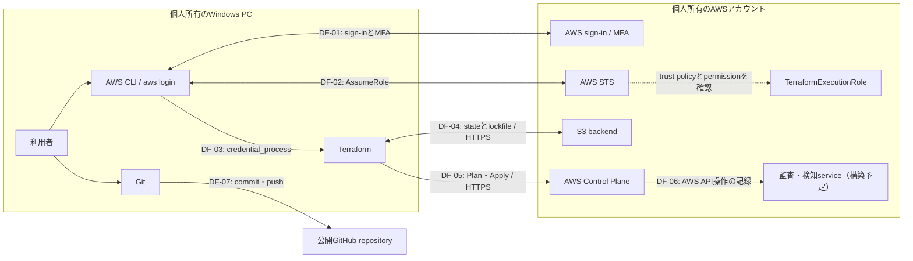

# Terraform AWS Security Baseline セキュリティ設計・Threat Model

- 状態: 採用
- 制定日: 2026-08-27
- 最終更新日: 2026-09-10
- 対象: 個人所有の単一AWSアカウント、dev環境、ap-northeast-1

## 1. 目的

本プロジェクトは、将来、別のsystemを許可された利用者が
外部networkから安全に閲覧・操作できるAWS環境を構築するための
学習・検証環境とする。

その前提として、AWS resourceをTerraformで再現可能に管理し、
各security controlがどのriskを抑えるのか確認しながら基盤を構築する。

## 2. 守る資産

### A-01: AWS Identityと認証情報

AWS root user、Terraform日常実行用IAM user、TerraformExecutionRole、
MFAおよび`aws login`で取得する一時認証情報を保護対象とする。

これらが侵害されると、権限の範囲内でAWS resourceの参照、変更、削除、
新規作成が行われ、情報漏えい、security controlの無効化、
監査ログの改ざん、想定外の課金につながる可能性がある。

長期access keyを使用しない構成であっても、
有効期限内の一時認証情報が漏えいすれば悪用される可能性があるため、
認証情報をGit、Terraformコード、作業記録へ保存しない。

### A-02: Terraform state

Terraform stateは、Terraformコードと実際のAWS resourceを対応付けるための
管理情報であり、重要な保護対象とする。

stateにはresource ID、ARN、設定値などが記録され、
resourceによっては通知先メールアドレスなどの個人情報や
sensitiveな値が含まれる可能性がある。

stateが漏えいするとAWS環境の構成を第三者に把握される可能性があり、
改ざんまたは削除されると、Terraformが実際のAWS resourceを正しく管理できず、
意図しない作成、変更、削除につながる可能性がある。

そのため、stateはGitへ保存せず、公開を禁止したS3 backendで管理し、
暗号化、versioning、IAMによるaccess制御、HTTPS必須、
S3 lockfileによる同時更新防止を適用する。

### A-03: Terraformコードと設計文書

Terraformコード、変数定義、Provider・backend設定、ADRおよび各設計文書を、
AWS環境を再現し、変更理由を確認するための保護対象とする。

これらが意図せず変更されると、過剰なIAM permission、S3の公開、
loggingの停止、resourceの削除などがTerraform Planへ混入する可能性がある。

そのため、変更はGitで履歴管理し、Apply前に差分、`terraform fmt`、
`terraform validate`、`terraform plan`を確認する。
認証情報、個人情報、`terraform.tfvars`およびstateはGitへ保存しない。

### A-04: 監査ログと検知情報

CloudTrailのAWS操作履歴、AWS Configの構成変更履歴、
GuardDutyおよびSecurity Hubの検知結果を保護対象とする。

これらは、いつ、誰が、どのresourceへ何を行ったか、
どのような不審な動作や設定不備が検知されたかを確認するための情報である。

ログの記録が停止された場合や、保存された情報が削除・改ざんされた場合、
security incidentの発生範囲、原因、影響を正しく調査できなくなる。

そのため、記録の有効化だけでなく、保存先の非公開化、暗号化、
access制御、保持期間および監視停止の検知を設計する。

### A-05: AWS resourceとsecurity設定

IAM Role・Policy、S3 bucket、AWS Budgetおよび、
今後構築する監査・検知serviceの設定を保護対象とする。

これらは、access制御、stateの保護、費用の監視、
AWS操作の記録および異常の検知を実現するためのresourceである。

設定が許可なく変更または削除されると、権限の拡大、stateの漏えい・消失、
監査の停止、異常の見逃し、想定外の課金につながる可能性がある。

そのため、原則としてTerraformで管理し、
Apply前にPlanを確認する。
AWS Consoleで手動変更した場合は、変更理由を記録し、
必要な変更をTerraformコードにも反映する。

## 3. Threat Modelの対象範囲

### 3.1 対象に含めるもの

- 個人所有のWindows PCから`aws login`で認証し、
  IAM userからTerraformExecutionRoleを引き受けてTerraformを実行する経路
- 公開GitHub repositoryおよびローカル環境で管理するTerraformコードと設計文書
- 個人所有の単一AWSアカウント、dev環境、`ap-northeast-1`のAWS resource
- Terraform stateを保存するS3 backendと、stateを読み書きする通信経路
- AWS Budgetおよび本プロジェクトで構築予定のIAM、監査、検知に関するresource

### 3.2 対象に含めないもの

- 将来接続する別systemのapplication、business data、
  利用者認証・認可および外部networkからのaccess経路
- `stg`・`prod`環境、複数AWSアカウントおよびAWS Organizations
- HCP TerraformやCI/CDによるTerraformの自動実行、承認およびチーム権限管理
- 24時間体制の監視、security incidentへの完全自動対応
- AWSが管理するdata center、物理設備および基盤software

## 4. Trust Boundary

Trust Boundaryとは、管理主体または信頼条件が異なる領域の境界を指す。
境界を越える通信や操作について、認証、認可、暗号化および記録を確認する。

### TB-01: Windows PCとAWS認証の境界

個人所有のWindows PCは、AWSアカウントの外部に存在する。
利用者はInternet経由で`aws login`を実行し、
AWSのsign-inとMFAを経て一時認証情報を取得する。

この境界では、偽のsign-in画面による認証情報の窃取、
第三者によるなりすまし、PC内の一時認証情報の窃取を脅威として扱う。

対策として、root userとIAM userへのMFA、長期access keyの不使用、
有効期限のある一時認証情報およびHTTPS通信を使用する。

### TB-02: IAM userとTerraformExecutionRoleの境界

`aws login`で認証したIAM userは、
TerraformExecutionRoleを引き受けるためにAWS STSへ`AssumeRole`を要求する。

AWSは、IAM user側に`sts:AssumeRole`の許可があることと、
Roleのtrust policyがそのIAM userを信頼していることの両方を確認する。
両方が成立した場合に、Role用の一時認証情報が発行される。

この境界では、trust policyの対象が広すぎること、
IAM userが不要なRoleを引き受けられること、
TerraformExecutionRoleへ過剰なpermissionが設定されることを脅威として扱う。

対策として、Roleを引き受けられるPrincipalを対象のIAM userに限定し、
IAM userが引き受けられるRoleと、
TerraformExecutionRoleが操作できるAWS resourceを必要最小限にする。
`AssumeRole`とRoleによるAWS操作はCloudTrailで記録する。

### TB-03: TerraformとS3 backendの境界

ローカルPC上のTerraformは、TerraformExecutionRoleの一時認証情報を使用し、
Internet経由のHTTPS通信でS3 backendへ接続する。

Terraformは、dev環境のstate objectを読み書きし、
Terraform実行中は同じ保存先にS3 lockfileを一時的に作成する。

この境界では、権限のない利用者によるstateの読み取り・書き換え・削除、
誤ったbucketまたはobject keyへの保存、
複数のTerraform実行によるstateの競合を脅威として扱う。

対策として、S3 bucketの公開を禁止し、SSE-S3による保存時暗号化、
HTTPS必須、versioning、object単位のIAM permission、
S3 lockfileによる同時更新防止を適用する。

### TB-04: TerraformとAWS Control Planeの境界

TerraformはAWS Providerを介して各AWS serviceのAPIへ接続し、
AWS resourceの現在の状態を読み取り、作成・変更・削除を要求する。

この境界では、誤ったTerraformコード、意図しないApply、
改ざんされたProvider、過剰なRole permissionによる
AWS resourceの不正な作成・変更・削除を脅威として扱う。

対策として、AWS Providerのversionとchecksumを
`.terraform.lock.hcl`で固定する。
Apply前に`terraform fmt`、`terraform validate`、
`terraform plan`と変更差分を確認し、利用者が手動で承認する。

TerraformExecutionRoleのpermissionを必要最小限にし、
AWS APIへの通信にはHTTPSを使用する。
実行されたAWS API操作はCloudTrailで記録する。

### TB-05: ローカル環境と公開GitHub repositoryの境界

ローカル環境で作成したTerraformコードと設計文書は、
Gitでcommitされ、認証された暗号化通信を通じて
公開GitHub repositoryへpushされる。

この境界では、認証情報、個人情報、Terraform state、
`terraform.tfvars`などを誤って公開すること、
第三者によるrepositoryの不正変更を脅威として扱う。

対策として、公開できないファイルを`.gitignore`で除外し、
commit前に`git status`、`git diff`およびstaging内容を確認する。
認証情報や個人情報をTerraformコードと作業記録へ記載しない。

一度公開した情報はGitの履歴や外部のcacheへ残る可能性があるため、
削除すれば完全に非公開へ戻せるとは考えない。
認証情報を誤って公開した場合は、その認証情報を失効または更新する。

## 5. Data Flow

## 6. 脅威の分析方法

本プロジェクトでは、Threat Modelの分類方法としてSTRIDEを使用する。

| 分類 | 名称 | 本プロジェクトでの例 |
|---|---|---|
| S | Spoofing（なりすまし） | 盗まれた一時認証情報を使用して正規利用者になりすます |
| T | Tampering（改ざん） | Terraformコード、state、IAM Policyまたは監査ログを書き換える |
| R | Repudiation（否認） | 操作記録がなく、実行者が自分の操作ではないと主張する |
| I | Information Disclosure（情報漏えい） | state、認証情報または個人情報が公開される |
| D | Denial of Service（利用妨害） | stateやAWS resourceが使用不能になり、Terraformを実行できなくする |
| E | Elevation of Privilege（権限昇格） | IAM設定の不備を利用して、本来許可されていない権限を取得する |

各脅威について、脅威ID、関連する資産、Trust BoundaryまたはData Flow、
攻撃・事故の内容、影響、既存対策、追加対策および残存riskを記録する。

## 7. Risk評価方法

### 7.1 発生可能性

| 値 | 評価 | 基準 |
|---|---|---|
| 1 | 低 | 特殊な条件が必要で、通常の運用では発生しにくい |
| 2 | 中 | 一定の条件がそろえば発生する可能性がある |
| 3 | 高 | 攻撃または操作ミスによって容易に発生する可能性がある |

### 7.2 影響度

| 値 | 評価 | 基準 |
|---|---|---|
| 1 | 低 | 影響が限定的で、容易に復旧できる |
| 2 | 中 | AWS resourceの変更や一時的な管理不能が発生し、復旧作業が必要になる |
| 3 | 高 | AWSアカウント、認証情報、stateまたは監査記録が侵害され、重大な漏えい・破壊・課金につながる |

### 7.3 Risk score

Risk scoreは、発生可能性と影響度を掛け合わせて算出する。

`Risk score = 発生可能性 × 影響度`

| Risk score | 優先度 |
|---|---|
| 1〜2 | 低 |
| 3〜4 | 中 |
| 6〜9 | 高 |

各脅威について、次の3段階でriskを記録する。

- 固有risk: security controlを考慮しない状態のrisk
- 現在の残存risk: 現在までに実装・確認済みのcontrolを考慮したrisk
- 目標残存risk: 追加予定のcontrolが実装・確認された後に想定するrisk

予定しているだけのcontrolは、現在の残存riskを下げる根拠に含めない。

## 8. 脅威シナリオ

### TH-01: 一時認証情報の窃取となりすまし

| 項目 | 内容 |
|---|---|
| STRIDE | S: Spoofing |
| 関連資産 | A-01、A-02、A-05 |
| 関連境界 | TB-01、TB-02 |
| 関連Data Flow | DF-01、DF-02、DF-03 |
| シナリオ | phishingやPCの侵害により、有効期限内のIAM userまたはTerraformExecutionRoleの一時認証情報が盗まれ、第三者が正規利用者としてAWS APIを実行する |
| 影響 | Roleのpermission範囲内で、stateの読み書き、AWS resourceやsecurity設定の変更、想定外のresource作成が行われる可能性がある |
| 既存control | root userとIAM userへのMFA、長期access keyの不使用、`aws login`による一時認証情報、IAM userとTerraformExecutionRoleの分離、Role permissionのresource制限 |
| 追加予定control | CloudTrailによる操作記録、GuardDutyによる不審な認証情報利用の検知、IAM permissionの定期確認 |
| 固有risk | 発生可能性3 × 影響度3 = 9（高） |
| 現在の残存risk | 発生可能性2 × 影響度3 = 6（高） |
| 目標残存risk | 発生可能性2 × 影響度2 = 4（中） |
| 残存risk | 有効期限内の一時認証情報が盗まれた場合、失効または期限切れになるまで悪用される可能性が残る。GuardDutyもすべての不正利用を必ず検知できるわけではない |

### TH-02: Terraform stateの改ざん・削除

| 項目 | 内容 |
|---|---|
| STRIDE | T: Tampering、D: Denial of Service |
| 関連資産 | A-02、A-05 |
| 関連境界 | TB-03 |
| 関連Data Flow | DF-04 |
| シナリオ | 認証情報を取得した第三者や誤操作により、S3上のstateが不正に上書き・削除される。または複数のTerraform実行が競合し、stateの整合性が失われる |
| 影響 | Terraformコードと実際のAWS resourceの対応関係が崩れ、誤った作成・変更・削除がPlanへ表示される、またはTerraformによる管理を継続できなくなる |
| 既存control | S3の非公開化、SSE-S3、HTTPS必須、versioning、state objectに限定したIAM permission、state objectへの`DeleteObject`不許可、S3 lockfile |
| 追加予定control | state復旧手順の作成と復旧test、S3 bucketへの`prevent_destroy`の検討、S3 data eventの記録要否と費用の検討 |
| 固有risk | 発生可能性3 × 影響度3 = 9（高） |
| 現在の残存risk | 発生可能性2 × 影響度3 = 6（高） |
| 目標残存risk | 発生可能性1 × 影響度2 = 2（低） |
| 残存risk | `PutObject`を許可された認証情報が侵害されるとstateを上書きできる。versioningがあっても、正しいversionを特定して復旧する作業が必要になる |

### TH-03: 公開GitHub repositoryへの機密情報混入

| 項目 | 内容 |
|---|---|
| STRIDE | I: Information Disclosure |
| 関連資産 | A-01、A-02、A-03 |
| 関連境界 | TB-05 |
| 関連Data Flow | DF-07 |
| シナリオ | 認証情報、個人情報、Terraform state、`terraform.tfvars`などを誤ってstaging・commitし、公開GitHub repositoryへpushする |
| 影響 | 認証情報の不正利用、AWS環境の構成把握、stateに含まれる情報や個人情報の漏えいにつながる。一度取得された情報は、GitHubから削除しても第三者の手元に残る可能性がある |
| 既存control | `.gitignore`によるstate・`terraform.tfvars`・ローカル作業記録の除外、`terraform.tfvars.example`の使用、commit前の`git status`・`git diff`・staging内容の確認、長期access keyの不使用 |
| 追加予定control | push前のsecret scan、GitHubのsecret scanning・push protectionの利用可否確認、漏えい時の認証情報失効手順の作成 |
| 固有risk | 発生可能性3 × 影響度3 = 9（高） |
| 現在の残存risk | 発生可能性2 × 影響度3 = 6（高） |
| 目標残存risk | 発生可能性1 × 影響度3 = 3（中） |
| 残存risk | 自動scanでは独自形式の情報や個人情報を検知できない場合がある。公開前に人が内容を確認する必要が残る |

### TH-04: IAMの過剰権限と権限昇格

| 項目 | 内容 |
|---|---|
| STRIDE | E: Elevation of Privilege |
| 関連資産 | A-01、A-05 |
| 関連境界 | TB-02、TB-04 |
| 関連Data Flow | DF-02、DF-05 |
| シナリオ | TerraformExecutionRoleのtrust policyまたはpermission policyを広く設定しすぎた結果、想定外のPrincipalがRoleを引き受ける、またはRoleが本プロジェクトに不要なAWS resourceやIAM設定を操作できる |
| 影響 | 本来許可されていないAWS resourceの参照・変更・削除、security controlの無効化、新たなIAM権限の作成、想定外の課金につながる可能性がある |
| 既存control | 日常実行用IAM userとTerraformExecutionRoleの分離、trust policyのPrincipal限定、S3 bucket・state objectを実値ARNで限定したpermission、`AdministratorAccess`を使用しない方針 |
| 実装反映・追加予定control | CloudTrailの管理イベント記録、AWS Configの選択resource記録、Security Hubは実装済み。ただしIAMの全設定不備を検知するとは限らない。permission追加理由の記録、Policy validation、定期的なpermission確認は継続する |
| 固有risk | 発生可能性3 × 影響度3 = 9（高） |
| 現在の残存risk | 発生可能性2 × 影響度3 = 6（高） |
| 目標残存risk | 発生可能性1 × 影響度3 = 3（中） |
| 残存risk | AWS APIによっては`Resource: "*"`が必要になるため、すべてのpermissionを特定resourceへ限定できるわけではない。permission追加時の人による判断ミスも残る |

### TH-05: 監査ログの停止・削除・改ざん

| 項目 | 内容 |
|---|---|
| STRIDE | T: Tampering、R: Repudiation |
| 関連資産 | A-04、A-05 |
| 関連境界 | TB-04 |
| 関連Data Flow | DF-05、DF-06 |
| シナリオ | 認証情報を取得した第三者または誤操作により、CloudTrailの記録が停止される、ログ保存先や転送設定が変更される、または保存済みログが削除・改ざんされる |
| 影響 | 誰が、いつ、どのAWS APIを実行したか確認できず、security incidentの発生範囲・原因・影響を調査できなくなる |
| 既存control | IAM userとTerraformExecutionRoleの分離、TerraformコードとGitによる設定変更履歴、multi-region CloudTrailによるmanagement events記録、専用S3 bucket、公開防止、versioning、30日保持、Log File Validation、customer managed KMS key、CloudTrailLogReadRoleによる限定閲覧 |
| 実装反映・追加予定control | AWS Configによる選択resourceの構成変更記録は実装済み。CloudTrail用S3のHTTPS必須化は未実装。CloudWatch Logs転送はADR 0005で見送り、必要時に再判断する |
| 固有risk | 発生可能性3 × 影響度3 = 9（高） |
| 現在の残存risk | 発生可能性2 × 影響度3 = 6（高） |
| 目標残存risk | 発生可能性1 × 影響度2 = 2（低） |
| 残存risk | 正当な管理権限を持つ認証情報が侵害された場合、記録停止と証跡破壊を完全には防止できない。ログ到着の遅延も考慮する必要がある |

### TH-06: 意図しないTerraform Applyとコード・Providerの改ざん

| 項目 | 内容 |
|---|---|
| STRIDE | T: Tampering、D: Denial of Service |
| 関連資産 | A-03、A-05 |
| 関連境界 | TB-04、TB-05 |
| 関連Data Flow | DF-05、DF-07 |
| シナリオ | 誤ったコード、確認不足のPlan、改ざんされたTerraform Providerまたは第三者によるrepository変更を信頼してApplyし、想定外のresource作成・変更・削除を実行する |
| 影響 | security controlの弱体化、ログやstate保存先の削除、AWS resourceの利用不能、想定外の課金につながる可能性がある |
| 既存control | Gitによる変更履歴、`.terraform.lock.hcl`によるProvider version・checksum固定、`terraform fmt`、`terraform validate`、`terraform plan`、手動承認、Apply後の`No changes`確認 |
| 追加予定control | staging差分とPlanの確認checklist、`destroy`・replaceの明示確認、機密情報・Terraform設定の自動scan、Phase 8の再構築・削除test |
| 固有risk | 発生可能性3 × 影響度3 = 9（高） |
| 現在の残存risk | 発生可能性2 × 影響度3 = 6（高） |
| 目標残存risk | 発生可能性1 × 影響度2 = 2（低） |
| 残存risk | Planを確認する利用者自身が誤って承認する可能性は残る。checksumは正規Providerの意図しない仕様変更までは防止しない |

### TH-07: S3 bucketの意図しない公開

| 項目 | 内容 |
|---|---|
| STRIDE | I: Information Disclosure |
| 関連資産 | A-02、A-04、A-05 |
| 関連境界 | TB-03、TB-04 |
| 関連Data Flow | DF-04、DF-05、DF-06 |
| シナリオ | bucket policy、ACL、Public Access BlockまたはObject Ownershipの設定不備により、state、監査ログまたはConfig履歴がInternetへ公開される |
| 影響 | AWS環境の構成、操作履歴、resource ID、個人情報またはsensitiveな設定値が第三者へ漏えいする可能性がある |
| 既存control | state bucketのbucket単位Public Access Block、BucketOwnerEnforced、非公開policy、HTTPS必須、SSE-S3、IAMによるaccess制御 |
| 実装反映・追加予定control | アカウントレベルS3 Block Public Access、CloudTrail・Config bucketの公開防止、外部Access Analyzer、Config Rules、Security Hubは実装済み。後続bucketにも保護を適用し、検知対象・有効なcontrolの範囲を確認する |
| 固有risk | 発生可能性3 × 影響度3 = 9（高） |
| 現在の残存risk | 発生可能性2 × 影響度3 = 6（高） |
| 目標残存risk | 発生可能性1 × 影響度3 = 3（中） |
| 残存risk | 強い管理権限で複数の防御設定を意図的に解除された場合は公開できる可能性が残る。公開後の情報は完全に回収できない |

### TH-08: KMS keyの誤設定・無効化・削除

| 項目 | 内容 |
|---|---|
| STRIDE | D: Denial of Service、E: Elevation of Privilege |
| 関連資産 | A-04、A-05 |
| 関連境界 | TB-04 |
| 関連Data Flow | DF-05、DF-06 |
| シナリオ | key policyの誤設定で想定外のPrincipalへ利用・管理権限を与える、必要なserviceが暗号鍵を使用できなくなる、またはkeyを無効化・削除予約する |
| 影響 | ログの暗号化・復号ができなくなり、監査serviceの配信停止、保存済み証跡の利用不能、不正な復号につながる可能性がある |
| 既存control | CloudTrail・Config共有のcustomer managed KMS key、用途を限定したkey policy、rotation、30日削除待機、Terraformの`prevent_destroy`。TerraformExecutionRoleへの直接のPutKeyPolicy許可を除去。証跡閲覧Roleでは対象keyのkms:*を明示的Deny。stateはSSE-S3であり共有keyに依存しない |
| 実装反映・追加予定control | aliasは不採用。TerraformExecutionRoleから`kms:DisableKey`と`kms:ScheduleKeyDeletion`を外し、復旧用の`kms:CancelKeyDeletion`と`kms:EnableKey`は残す変更をコードへ反映済み・AWS適用待ち。復旧手順の実環境試験はPhase 8まで行わない |
| 固有risk | 発生可能性2 × 影響度3 = 6（高） |
| 現在の残存risk | 発生可能性2 × 影響度3 = 6（高）。通常Roleに停止・削除予約権限が残るAWS実体を基準とする。権限縮小のapplyとeffective permission確認後に再評価する |
| 目標残存risk | 発生可能性1 × 影響度2 = 2（低） |
| 残存risk | key policyを変更できる管理権限の侵害と、削除待機期間経過後のkey material消失は完全には防止できない |

### TH-09: 不正利用・誤操作による想定外の課金

| 項目 | 内容 |
|---|---|
| STRIDE | D: Denial of Service、E: Elevation of Privilege |
| 関連資産 | A-01、A-05 |
| 関連境界 | TB-02、TB-04 |
| 関連Data Flow | DF-02、DF-05 |
| シナリオ | 侵害された認証情報、過剰なpermissionまたはTerraform設定ミスにより、高額resource、大量ログまたは不要な有料機能が作成・有効化される |
| 影響 | 想定外のAWS利用料金が発生し、検証継続が困難になる。費用を止めるための調査・削除作業も必要になる |
| 既存control | 月額10 USDのAWS Budget、1・3・5・8・10 USDの実績額通知、OutlookとWindows通知、Phaseごとの課金確認、NAT Gateway・EC2・専用public IPv4を原則作成しない方針 |
| 追加予定control | 各Phaseの公式料金・無料trial終了日・推定月額確認、GuardDuty Protection Planなど自動有効化項目の確認、実測費用と残存resourceの記録 |
| 固有risk | 発生可能性3 × 影響度2 = 6（高） |
| 現在の残存risk | 発生可能性2 × 影響度2 = 4（中） |
| 目標残存risk | 発生可能性1 × 影響度2 = 2（低） |
| 残存risk | Budgetはresourceを停止する上限ではなく、料金情報と通知には遅延がある。通知確認前に費用が増える可能性は残る |

### TH-10: Network設定不備による意図しない通信許可

| 項目 | 内容 |
|---|---|
| STRIDE | I: Information Disclosure、E: Elevation of Privilege |
| 関連資産 | A-05 |
| 関連境界 | TB-04 |
| 関連Data Flow | DF-05、DF-06 |
| シナリオ | Security Group、route table、subnetまたはInternet Gatewayの設定不備により、想定していない送信元・宛先・portへの通信を許可する |
| 影響 | 将来配置するresourceへの不正access、情報漏えい、侵害後の横展開につながる可能性がある |
| 既存control | 検証用VPCとnetwork resourceは未構築。EC2、NAT Gateway、専用public IPv4を原則作成しない方針 |
| 追加予定control | 必要最小限のSecurity Group、public/private subnetとrouteの分離、不要なinbound ruleの禁止、VPC Flow Logs、PlanとAWS Consoleによる設定確認 |
| 固有risk | 発生可能性2 × 影響度3 = 6（高） |
| 現在の残存risk | 対象resource未構築のため評価対象外 |
| 目標残存risk | 発生可能性1 × 影響度3 = 3（中） |
| 残存risk | Network設定が正しくても、将来配置するapplication自体の脆弱性や認証不備は別のriskとして残る |

## 9. Security control対応表

| Control ID | Security control | 対応する脅威 | 状態 | 実施Phase |
|---|---|---|---|---|
| C-01 | root user・IAM userのMFA、一時認証情報、長期access key不使用 | TH-01 | 実装済み | Phase 1 |
| C-02 | IAM userとTerraformExecutionRoleの分離、限定したtrust policyとpermission | TH-01、TH-04、TH-09 | 一部実装・継続見直し | Phase 1〜8 |
| C-03 | 非公開・暗号化・versioning・HTTPS必須・lockfileを備えたS3 backend | TH-02、TH-07 | 実装済み | Phase 1 |
| C-04 | `.gitignore`、example変数、commit前差分確認、secret非保存 | TH-03、TH-06 | 一部実装・自動scan未実装 | Phase 0、8 |
| C-05 | アカウントレベルS3 Block Public Access、CloudTrail・Config共有customer managed KMS key（rotation、30日削除待機、`prevent_destroy`） | TH-07、TH-08 | 実装済み（alias不採用、破壊的権限縮小は適用待ち） | Phase 3〜6 |
| C-06 | multi-region CloudTrail、management events、専用S3、SSE-KMS、30日保持、log file validation、閲覧専用Role | TH-01、TH-04、TH-05、TH-06 | 実装済み（CloudWatch Logs転送は別途判断） | Phase 4 |
| C-07 | GuardDuty Foundational Threat Detectionによる不審な操作・認証情報利用の検知。対象外のProtection Planは明示的に無効化 | TH-01、TH-09 | 実装済み | Phase 5 |
| C-08 | IAM Access Analyzerのexternal access analyzer、Security Hub Essentials・CSPM・AWS Foundational Security Best Practicesによる外部公開・設定不備の検知 | TH-04、TH-07、TH-10 | 実装済み（Automation Rules・自動修復・有料addonは未採用） | Phase 5 |
| C-09 | AWS Configによる選択resourceの継続的な構成履歴記録、専用S3へのSSE-KMS暗号化保存、7つのManaged Rulesによる24時間ごとまたは設定変更時の準拠評価 | TH-04、TH-05、TH-07、TH-10 | 実装済み | Phase 6 |
| C-10 | AWS Budget、メール・Windows通知、Budget Actionによる高額リソース作成の自動抑止 | TH-09 | 実装済み | Phase 2 |
| C-11 | Provider lock、`fmt`、`validate`、`plan`、手動承認、`No changes`確認 | TH-02、TH-06、TH-09 | 実装済み・継続運用 | 全Phase |
| C-12 | 復旧・incident対応・destroy・残存resource確認 | TH-01〜TH-10 | 未実装 | Phase 8 |

「未実装」のcontrolは設計上の予定であり、現在の残存riskを下げる根拠には含めない。
Terraform Applyと機能testが完了した時点で、状態を「実装済み」へ更新する。

## 10. Risk一覧と対応優先度

| 脅威ID | 概要 | 現在の残存risk | 目標残存risk | 主な対応Phase |
|---|---|---|---|---|
| TH-01 | 一時認証情報の窃取となりすまし | 6（高） | 4（中） | Phase 4、5 |
| TH-02 | Terraform stateの改ざん・削除 | 6（高） | 2（低） | Phase 8、S3 data eventは別途判断 |
| TH-03 | 公開GitHubへの機密情報混入 | 6（高） | 3（中） | Phase 8、継続運用 |
| TH-04 | IAMの過剰権限と権限昇格 | 6（高） | 3（中） | Phase 4〜6、継続運用 |
| TH-05 | 監査ログの停止・削除・改ざん | 6（高） | 2（低） | Phase 4、6 |
| TH-06 | 意図しないApplyとコード・Provider改ざん | 6（高） | 2（低） | 全Phase、Phase 8 |
| TH-07 | S3 bucketの意図しない公開 | 6（高） | 3（中） | Phase 3〜6 |
| TH-08 | KMS keyの誤設定・無効化・削除 | 共有key稼働中・再評価待ち | 2（低、目標値） | Phase 3、8 |
| TH-09 | 不正利用・誤操作による想定外の課金 | 4（中） | 2（低） | 全Phase |
| TH-10 | Network設定不備による意図しない通信許可 | 対象resource未構築 | 3（中） | Phase 7 |

現在「高」のriskは、後続Phaseのcontrolが未実装であることを反映している。
本番workloadとbusiness dataを配置しない条件で一時的に受容し、
対応Phaseの完了時に再評価する。

## 11. Controlの実装完了条件

Security controlは、設計またはTerraformコードへ記載しただけでは実装済みとしない。
次の条件をすべて確認した場合に実装済みとする。

1. controlの目的と対応する脅威IDが記録されている。
2. 課金項目、推定費用、無料trial、削除方法を確認している。
3. TerraformコードがGitで管理され、認証情報と個人情報を含まない。
4. `terraform fmt`と`terraform validate`が成功している。
5. `terraform plan`で作成・変更・削除を確認し、意図しない`destroy`やreplaceがない。
6. `terraform apply`が成功し、AWS上の実体をConsoleまたはCLIで確認している。
7. 公開拒否、ログ到着、検知、通知など、controlの目的に対応する機能testが成功している。
8. Apply後の`terraform plan`が`No changes`になる。
9. 証跡、判断理由、残存resource、継続月額を記録している。

目標残存riskは、対応するcontrolがこの完了条件を満たした後に再評価する。

## 12. Security incident時の初動原則

1. 新たなTerraform Applyを停止し、発生時刻、画面、command結果を保存する。
2. 認証情報の侵害が疑われる場合は、該当sessionを失効させ、password・MFA・Roleのtrust関係を確認する。
3. CloudTrail、GuardDuty、AWS ConfigおよびGit履歴から、実行者、時刻、対象resource、変更内容を特定する。
4. 必要最小限のpermissionへ縮小し、不審なresourceや公開設定を隔離する。
5. state異常の場合は現在のstateを別途保全し、S3 versioningから復旧対象versionを特定してから復元する。
6. AWS BudgetとBilling情報を確認し、想定外の有料resourceを特定する。
7. 原因、影響、復旧内容、再発防止策を記録し、必要な変更をTerraformコードへ反映する。

調査に必要なログやstateを、証跡保全前に削除または上書きしない。
詳細なcommandとservice別手順はPhase 8でrunbookとして作成する。

### 12.1 Findingの調査・判断手順

Security HubまたはGuardDutyのFindingは、異常の確定ではなく調査開始の合図として扱う。
Findingだけで実行者や正当性を判断せず、CloudTrailの元イベントと自分の変更記録を照合する。

1. Security Hubで、検知元service、Finding type、Severity、検知時刻およびworkflow statusを確認する。
2. CloudTrail Event historyまたは保存済みCloudTrailログで、identity、API、対象resource、時刻、source IP addressおよびUser-Agentを確認する。
3. Terraformの`plan`、Gitの変更履歴、承認済みの作業内容と、APIおよび対象resourceが一致するか判断する。
4. 一致しない、または判断に必要な情報が不足する場合は、Findingを`IN PROGRESS`のまま保持し、認証情報の保護と影響範囲の調査を優先する。
5. 正当な操作であり対応が完了した場合だけ、調査根拠と再発防止策を記録してFindingを`RESOLVED`にする。

root userは個別利用者を識別する日常運用用identityではない。root userによる操作が検知された場合は、操作の正当性を確認した後も、通常作業をIAM userとRoleの一時認証情報へ戻す。

## 13. 課金を伴うcontrolの判断ルール

次のcontrolは利用量、保存量、評価回数または有効期間に応じて課金される可能性がある。

- customer managed KMS keyとKMS API request
- CloudTrailの追加copy、S3 data event、CloudTrail Insights
- CloudWatch Logsの取り込み、保存、検索、metric・alarm
- GuardDutyのProtection Planと分析量
- Security Hubの有効機能、security checkおよびfinding取り込み
- AWS Configの記録項目、rule評価、conformance pack
- VPC Flow Logsの配信先における取り込み・保存
- S3のログ・state・versioningによる保存量とrequest

各PhaseのApply前に、実装時点のAWS公式料金、無料trial終了日、
対象region、記録対象、保持期間、推定月額および削除方法を確認する。

AWS Budgetは課金を停止する機能ではなく、料金情報と通知には遅延がある。
最初は対象・保持期間・rule・Protection Planを必要最小限にし、
機能testと実測費用を確認してから拡張する。

## 14. 見直し条件

このThreat Modelは次の場合に見直す。

- 各Phaseが完了し、controlの実装状態または残存riskが変化したとき
- IAM user、Role、trust policy、permission policyを変更したとき
- 新しいAWS service、region、accountまたはenvironmentを追加したとき
- 将来の別system、application、business data、利用者認証、外部access経路を接続するとき
- security incident、認証情報漏えい、state異常または想定外の課金が発生したとき
- AWS serviceの仕様、Terraform Providerまたは料金体系が変わったとき
- 定期見直し日である2026-11-27に到達したとき

見直し時は、資産、対象範囲、Trust Boundary、Data Flow、脅威、control、
現在の残存risk、目標残存risk、課金見積りを更新する。

## 15. 文書の完了状態

本書は、Phase 3以降の実装判断に使用するThreat Modelの初版として採用する。
文書の完成は、未実装controlがAWS上で有効になったことを意味しない。
実装状態はSecurity control対応表と各Phaseの検証記録で継続管理する。
