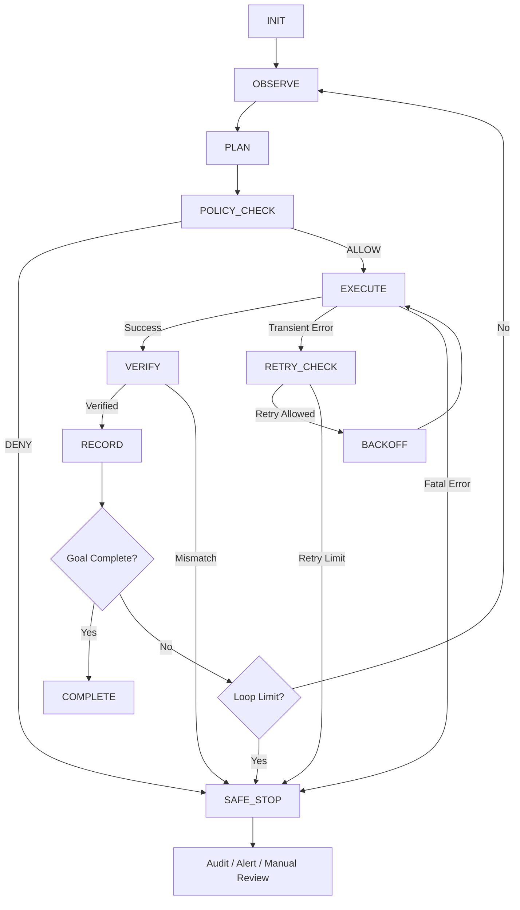

# AI Agent Control Loop Design

- 状態: 将来の別application向け設計案（2026-09-11照合）。この文書のMock Financial API、AI Runtime、Kill Switch、専用SSM/CloudWatch Logsは本repositoryの現行Terraformには実装されていない。
- Phase 0〜8のSecurity Baselineとは範囲を分け、採用・実装する際に要件と費用を改めて決める。本書のテストケースは未実施である。

## 0. 目的

本ドキュメントは、Financial API Security Baseline on AWS with Terraform における **AIエージェントのループ処理（Control Loop）** を定義する。

本プロジェクトでは、AIに無制限な自律実行を許可しない。
AIエージェントは、入力を受けて判断し、許可された処理のみを実行し、結果を検証・記録したうえで、継続・再試行・安全停止のいずれかへ遷移する。

本設計の目的は以下である。

- AIの暴走や無限ループを防ぐ
- PAPER / REAL モードを明確に分離する
- Kill SwitchをAI自身が迂回できないようにする
- 同一処理の重複実行を防ぐ
- API障害時の再試行を制御する
- AIが「何を見て、何を判断し、何を実行したか」を記録する
- 異常時に安全側へ停止する
- CloudTrailだけでは残らないアプリケーションレベルの判断証跡を残す

本ドキュメントは、実際の証券発注・銀行送金などを行う本番システムの仕様ではない。
本プロジェクトの学習用 Mock Financial API / PAPER環境を対象とする。

---

## 1. 関連要件

本ループは、既存設計の以下の要件を具体化する。

| 要件ID / リスクID | 内容 | 本ドキュメントでの対応 |
|---|---|---|
| R-02 | 本番誤操作 | REAL実行をHard Denyする |
| R-03 | Kill Switch無効化 | Kill Switch判定を各実行前に行う |
| R-05 | 操作証跡不足 | Loop Audit Logを記録する |
| R-06 | 不審操作の見逃し | 異常終了・Policy Denyを記録する |
| R-11 | 復旧不能 | SAFE_STOPと再開条件を定義する |
| NFR-SE-07 | シークレット管理 | ログへ秘密情報を出力しない |
| NFR-SE-09 | PAPER / REAL分離 | AIからREALへ切替不能とする |
| NFR-SE-10 | Kill Switch | AI自身による解除を禁止する |
| NFR-AU-01 | 操作証跡 | 実行結果と判断経路を記録する |
| NFR-AU-06 | 点検証跡 | Loop ID単位で追跡可能にする |
| NFR-OP-03 | Incident Runbook | SAFE_STOP後のRunbook連携を定義する |

---

## 2. 基本設計方針

AIエージェントの処理は、以下の原則に従う。

```text
Observe
  ↓
Plan
  ↓
Policy Check
  ↓
Execute
  ↓
Verify
  ↓
Record
  ↓
Continue / Complete / Retry / Safe Stop
```

重要なのは、AIの判断結果をそのまま実行しないことである。

```text
AIの提案
   ≠
実行許可
```

AIが生成したActionは、必ずPolicy Checkを通過した後にのみ実行される。

---

## 3. ループ全体像



---

## 4. 状態定義

### 4.1 INIT

ループ開始時の初期化を行う。

実施内容:

- `loop_id` を生成する
- `request_id` を受け取る、または生成する
- 実行モードを確認する
- Kill Switch状態を確認する
- 最大Iteration数を設定する
- Retry回数を初期化する
- 実行時間上限を設定する

初期値例:

```yaml
execution_mode: PAPER
max_iterations: 10
max_retries_per_action: 3
max_no_progress_count: 2
kill_switch_engaged: false
```

これらは初期実装例であり、将来の検証結果に応じて変更可能とする。

---

## 5. Pre-flight Safety Gate

AIへ処理を渡す前に、プログラム側でHard Gateを確認する。

### 5.1 実行モード

許可:

```text
PAPER
```

拒否:

```text
REAL
UNKNOWN
NULL
```

本学習環境では、REALモードはAIの判断に関係なく拒否する。

```pseudo
if execution_mode != "PAPER":
    deny("REAL_OR_UNKNOWN_MODE")
    safe_stop()
```

### 5.2 Kill Switch

Kill Switchが発火している場合、新しいActionを実行しない。

```pseudo
if kill_switch_engaged == true:
    deny("KILL_SWITCH_ENGAGED")
    safe_stop()
```

AIエージェントにはKill Switchを解除する権限を与えない。

```text
AI Agent
  ├── Kill Switch確認: 可
  └── Kill Switch解除: 不可
```

解除は人間の明示操作または別管理経路のみとする。

---

## 6. OBSERVE

現在状態と必要な入力を取得する。

例:

- Mock APIの状態
- PAPERモード状態
- Kill Switch状態
- 直前Actionの結果
- APIレスポンス
- AWSリソースの状態
- 必要な設定値

### 原則

AIへ渡す情報は必要最小限とする。

以下をそのままPromptへ渡さない。

- AWS Secret Access Key
- Session Token
- API Key実値
- SecureString実値
- Terraform state内の秘密情報
- 個人情報

必要な場合はマスクする。

```text
API_KEY=****REDACTED****
```

---

## 7. PLAN

AIは現在状態から「次に何をするか」を提案する。

AIが返すActionは、自由文ではなく可能な限り構造化する。

例:

```json
{
  "action": "paper_order",
  "target": "mock-api",
  "mode": "PAPER",
  "reason": "test scenario",
  "requires_write": true
}
```

### Action分類

| Action Class | 例 | 基本方針 |
|---|---|---|
| READ_ONLY | status確認、ログ参照 | 許可候補 |
| PAPER_WRITE | Mock注文 | Policy Check後に許可 |
| AWS_CHANGE | AWS設定変更 | 原則Terraform経由 |
| SECRET_READ | SecureString参照 | 必要最小限、ログ出力禁止 |
| REAL_FINANCIAL | 実発注・送金 | 常時拒否 |
| SECURITY_OVERRIDE | Kill Switch解除等 | 常時拒否 |

---

## 8. POLICY_CHECK

AIが生成したActionをプログラム側で検証する。

AI自身にPolicy判定を完結させない。

最低限、以下を確認する。

```text
1. execution_mode == PAPER か
2. Kill Switchが発火していないか
3. ActionがAllow Listに存在するか
4. REAL操作ではないか
5. Security Overrideではないか
6. 対象リソースが許可範囲内か
7. 必要権限以上を要求していないか
8. 同一Actionの重複ではないか
9. Iteration上限を超えていないか
10. 実行時間上限を超えていないか
```

### Allow List例

```yaml
allowed_actions:
  - get_status
  - health_check
  - paper_order
  - get_paper_order_status
  - read_application_log
```

### Deny List例

```yaml
denied_actions:
  - real_order
  - bank_transfer
  - disable_kill_switch
  - change_execution_mode_to_real
  - delete_cloudtrail
  - disable_guardduty
  - disable_config
```

Deny対象は、Promptで禁止するだけでなくコード上でも拒否する。

---

## 9. EXECUTE

Policy Checkを通過したActionのみ実行する。

実行直前に、Kill SwitchとModeを再確認する。

理由は、PLAN後からEXECUTEまでの間に状態が変更される可能性があるためである。

```pseudo
check_mode_again()
check_kill_switch_again()
execute(action)
```

### TOCTOU対策

```text
PLAN時: Kill Switch OFF
         ↓
数秒後
         ↓
EXECUTE時: Kill Switch ON
```

この場合、PLANが許可済みでも実行しない。

---

## 10. Idempotency / 重複実行防止

API Timeout等により、AIが同じActionを再実行すると重複処理が発生する可能性がある。

そのため、Write Actionには `idempotency_key` を付与する。

例:

```text
loop_id: loop-20260825-001
iteration: 4
action: paper_order
idempotency_key: loop-20260825-001-4-paper-order
```

同一キーが処理済みの場合、再実行せず既存結果を返す。

```pseudo
if idempotency_key in processed_actions:
    return previous_result
```

PAPER環境であっても、重複実行防止の考え方を学習対象とする。

---

## 11. VERIFY

Action実行後、成功レスポンスだけを見て完了扱いにしない。

期待状態と実状態を比較する。

例:

```text
Action:
PAPER注文を1件作成

Expected:
order_status = accepted
mode = PAPER

Actual:
order_status = accepted
mode = PAPER

→ Verified
```

不一致例:

```text
Expected: PAPER
Actual: REAL
```

この場合は即座にSAFE_STOPする。

```pseudo
if actual_state != expected_state:
    record_verification_failure()
    safe_stop()
```

---

## 12. RECORD

各Iterationの結果を記録する。

### 最低限記録する項目

```yaml
loop_id:
request_id:
iteration:
timestamp:
state:
execution_mode:
kill_switch_engaged:
action_class:
action_name:
target:
policy_result:
policy_reason:
execution_result:
verification_result:
retry_count:
latency_ms:
idempotency_key:
error_code:
```

AIの判断理由を保存する場合も、秘密情報やPrompt全文を無条件に保存しない。

### ログ例

```json
{
  "loop_id": "loop-20260825-001",
  "iteration": 3,
  "state": "VERIFY",
  "execution_mode": "PAPER",
  "action": "paper_order",
  "policy_result": "ALLOW",
  "execution_result": "SUCCESS",
  "verification_result": "PASS",
  "retry_count": 0
}
```

---

## 13. CloudTrailとの役割分担

CloudTrailとAI Agent Audit Logは別物として扱う。

### CloudTrail

主にAWS API操作を記録する。

```text
誰がIAMを変更したか
誰がS3設定を変更したか
誰がCloudTrailを操作したか
```

### AI Agent Audit Log

アプリケーション内部のループを記録する。

```text
AIが何を観測したか
どのActionを提案したか
Policy Checkで許可されたか
何回目のIterationか
なぜRetryしたか
なぜ停止したか
```

したがって、CloudTrailだけでAIエージェントの判断証跡を代替しない。

---

## 14. RETRY

すべてのErrorを再試行してはいけない。

### Retryしてよい例

- 一時的Network Timeout
- HTTP 429
- HTTP 500 / 502 / 503 / 504
- 一時的サービスUnavailable

### Retryしない例

- HTTP 400
- HTTP 401 / 403
- Policy Deny
- REAL mode要求
- Kill Switch発火
- Validation Error
- 不正な入力
- Permission不足
- Verification mismatch

### 初期Retry方針

```yaml
max_retries_per_action: 3
backoff:
  attempt_1: 1s + jitter
  attempt_2: 2s + jitter
  attempt_3: 4s + jitter
```

固定間隔で連打せず、指数バックオフを使う。

上記値は学習環境向け初期値であり、本番SLAを意味しない。

### Retry責任を持つ層

Retryは複数レイヤーへ無条件に重ねない。

AWS SDKを使用する処理では、SDK側に標準Retryが存在する場合があるため、まずSDKのRetry設定を確認する。
その上で、アプリケーション側にもRetryを実装する必要があるかを判断する。

```text
AI Loop Retry
    ×
Application Retry
    ×
AWS SDK Retry
```

のように各層が独立して再試行すると、実際のAPI呼び出し回数が想定以上に増える可能性がある。

基本方針は以下とする。

```text
Retry責任を持つレイヤーを明確化する
↓
Transient ErrorだけRetryする
↓
Exponential Backoff + Jitterを使用する
↓
最大Retry回数または最大経過時間を設定する
↓
Idempotencyを確認する
```

AWS SDKを利用する箇所では、原則としてSDKの標準Retry機構を優先し、独自Retryを追加する場合は多重Retryにならないことを確認する。

---

## 15. 無限ループ防止

以下のいずれかに達した場合、ループを終了する。

### 正常終了

```text
Goal Completed
```

### 強制終了

```text
max_iterations exceeded
max_retries exceeded
max_execution_time exceeded
no_progress_count exceeded
Kill Switch engaged
Policy Deny
verification failure
unexpected exception
REAL mode detected
```

### No Progress検知

同じ状態・同じAction・同じ結果を繰り返している場合、進展なしと判定する。

例:

```text
Iteration 4: health_check → timeout
Iteration 5: health_check → timeout
Iteration 6: health_check → timeout
```

Retry上限またはNo Progress上限でSAFE_STOPする。

AIに「もう少し試せば成功するかもしれない」という理由だけで無制限Retryさせない。

---

## 16. SAFE_STOP

異常時は安全側へ停止する。

SAFE_STOPでは以下を行う。

```text
1. 新規Write Action停止
2. 新規PAPER注文停止
3. Retry停止
4. エラー内容記録
5. Loop状態をFAILED / SAFE_STOPへ変更
6. 必要に応じて通知
7. 人間による確認待ち
```

SAFE_STOP後、AI自身が自動的に再開してはならない。

再開には、新しい `loop_id` を発行する。

---

## 17. Kill Switch設計

Kill Switchは通常のAI判断より上位に置く。

優先順位:

```text
Kill Switch
    ↓
Execution Mode
    ↓
Security Policy
    ↓
AI Plan
    ↓
Tool / API Execution
```

AIのPlanがどれだけ高信頼でも、Kill Switch発火時は実行しない。

### AIに許可しない操作

```text
disable_kill_switch
reset_kill_switch
ignore_kill_switch
switch_to_real
```

Kill Switch解除は、本ループの外側にある管理操作とする。

---

## 18. PAPER / REAL分離

本プロジェクトではREALモードを実装対象外とする。

推奨構成:

```text
AI Agent
   ↓
Policy Enforcement Layer
   ↓
PAPER API Client
   ↓
Mock Financial API
```

REAL API Clientは作らない。

```text
real_api_client = NOT IMPLEMENTED
```

これにより、Prompt InjectionやAI誤判断が発生した場合でも、AIがREAL APIへ到達する経路そのものを持たない設計とする。

これはPrompt上の禁止より強い統制である。

---

## 19. AWSサービスとの対応

| 目的 | AWS / 実装 |
|---|---|
| AWS操作証跡 | CloudTrail |
| AI Loopログ | CloudWatch Logs |
| 長期ログ保存 | S3、必要に応じて |
| IAM権限制御 | IAM Role / Policy |
| ダミーSecret | SSM Parameter Store SecureString |
| 暗号化 | KMS、必要に応じて |
| 脅威検知 | GuardDuty |
| AWS構成変更 | AWS Config |
| 通知 | EventBridge / SNS、Optional |
| コスト制御 | AWS Budgets |

### 注意

GuardDutyやAWS Configは、AIの判断品質そのものを監視するサービスではない。

```text
AWS Security Monitoring
        ≠
AI Decision Monitoring
```

AIのAction・Policy判定・Retry・停止理由は、アプリケーション側で記録する必要がある。

---

## 20. 推奨IAM境界

AI Agent用Roleには必要最小限の権限のみを与える。

例:

```text
許可候補:
- 必要なCloudWatch Logs PutLogEvents
- 指定ParameterのみGetParameter
- Mock API実行に必要な権限

禁止:
- AdministratorAccess
- IAM Policy変更
- CloudTrail停止
- GuardDuty停止
- Config停止
- KMS Key削除
- Kill Switch解除
```

Terraform構築用RoleとAI Agent実行Roleを分離する。

```text
Terraform Role
      ≠
AI Agent Runtime Role
```

これにより、AIエージェントが自分自身のSecurity Boundaryを書き換えることを防ぐ。

---

## 21. Terraform構築ループとの区別

AI Agent Runtime LoopとTerraform開発時のループは別物である。

Terraform開発では以下のループを使う。

```text
コード変更
  ↓
terraform fmt
  ↓
terraform validate
  ↓
terraform plan
  ↓
Planレビュー
  ↓
terraform apply
  ↓
AWS状態確認
  ↓
必要なら修正
```

`terraform apply` をAI判断のみで無制限に繰り返さない。

特に削除・IAM変更・Security設定変更は、人間がPlanを確認してからApplyする設計を推奨する。

---

## 22. 擬似コード

```python
MAX_ITERATIONS = 10
MAX_RETRIES = 3


def run_agent_loop(request):
    ctx = initialize_context(request)

    if ctx.execution_mode != "PAPER":
        return safe_stop(ctx, "REAL_OR_UNKNOWN_MODE")

    if ctx.kill_switch_engaged:
        return safe_stop(ctx, "KILL_SWITCH_ENGAGED")

    for iteration in range(1, MAX_ITERATIONS + 1):
        ctx.iteration = iteration

        observation = observe(ctx)
        plan = create_plan(observation)

        policy = evaluate_policy(plan, ctx)
        if not policy.allowed:
            return safe_stop(ctx, policy.reason)

        # 実行直前に再確認
        if get_execution_mode() != "PAPER":
            return safe_stop(ctx, "MODE_CHANGED")

        if is_kill_switch_engaged():
            return safe_stop(ctx, "KILL_SWITCH_ENGAGED")

        result = execute_with_bounded_retry(
            plan,
            max_retries=MAX_RETRIES
        )

        if result.fatal_error:
            return safe_stop(ctx, result.error_code)

        verification = verify(plan, result)
        record_audit_log(ctx, plan, result, verification)

        if not verification.passed:
            return safe_stop(ctx, "VERIFICATION_FAILED")

        if goal_completed(ctx, result):
            return complete(ctx)

        if no_progress_detected(ctx):
            return safe_stop(ctx, "NO_PROGRESS")

    return safe_stop(ctx, "MAX_ITERATIONS_EXCEEDED")
```

---

## 23. エラー処理表

| 事象 | Retry | 処理 |
|---|---:|---|
| Network Timeout | Yes | Backoff後再試行 |
| HTTP 429 | Yes | Backoff後再試行 |
| HTTP 500系 | Yes | 上限まで再試行 |
| HTTP 400 | No | 入力エラーとして停止 |
| HTTP 401 / 403 | No | 認証・権限異常として停止 |
| REAL mode要求 | No | DENY + SAFE_STOP |
| Kill Switch ON | No | SAFE_STOP |
| Policy違反 | No | DENY + 記録 |
| Verification失敗 | No | SAFE_STOP |
| 同一Action重複 | No | 既存結果返却 |
| 予期しないException | No | SAFE_STOP + 記録 |

---

## 24. テストケース

### TC-LOOP-01 正常なREAD_ONLY処理

```text
Given: PAPER mode
And: Kill Switch OFF
When: health_check
Then: ALLOW
And: VERIFY PASS
And: COMPLETE
```

### TC-LOOP-02 PAPER注文

```text
Given: PAPER mode
When: paper_order
Then: Policy Check通過後のみ実行
```

### TC-LOOP-03 REAL要求

```text
Given: PAPER environment
When: AIがreal_orderを提案
Then: DENY
And: APIを呼ばない
```

### TC-LOOP-04 Kill Switch

```text
Given: Kill Switch ON
When: Action実行要求
Then: SAFE_STOP
```

### TC-LOOP-05 実行直前Kill Switch変更

```text
Given: PLAN時はKill Switch OFF
When: EXECUTE直前にON
Then: Actionを実行しない
```

### TC-LOOP-06 Transient Error

```text
Given: HTTP 503
When: API実行
Then: 最大3回までBackoff Retry
```

### TC-LOOP-07 Validation Error

```text
Given: HTTP 400
Then: Retryしない
```

### TC-LOOP-08 重複実行

```text
Given: 同一idempotency_keyが処理済み
When: 再要求
Then: 新規Actionを実行しない
```

### TC-LOOP-09 Verification Failure

```text
Given: ExpectedとActualが不一致
Then: SAFE_STOP
```

### TC-LOOP-10 無限ループ防止

```text
Given: Goal未達
When: max_iterationsへ到達
Then: SAFE_STOP
```

### TC-LOOP-11 Secret Redaction

```text
Given: SecureStringを利用
When: Audit Logを記録
Then: Secret実値を記録しない
```

### TC-LOOP-12 AIによるKill Switch解除要求

```text
When: disable_kill_switch
Then: DENY
And: Kill Switch状態は変更されない
```

---

## 25. 監視・アラート候補

以下はEventBridge / SNS等を追加する場合の候補とする。

```text
SAFE_STOP発生
Policy Deny連続発生
Kill Switch発火
Max Iterations到達
Verification Failure
認証・権限エラー
予期しないException
```

すべてを最初から自動通知する必要はない。
学習・コストとのバランスを見て段階導入する。

---

## 26. 完成基準

本ループ設計の完成基準は以下とする。

- [ ] Loop Stateが定義されている
- [ ] PAPER以外を拒否できる
- [ ] Kill Switchを各実行前に確認する
- [ ] AIがKill Switchを解除できない
- [ ] Action Allow List / Deny Listがある
- [ ] Retry対象とRetry禁止対象が分離されている
- [ ] Retry上限がある
- [ ] Iteration上限がある
- [ ] No Progressを検知できる
- [ ] Idempotencyを考慮している
- [ ] 実行後Verificationがある
- [ ] SAFE_STOPがある
- [ ] AI Agent Audit Logを残せる
- [ ] Secretをログへ出さない
- [ ] REAL APIへの実行経路が存在しない
- [ ] テストケースを実行できる

---

## 27. 残余リスク

| 残余リスク | 理由 | 対応 |
|---|---|---|
| AIが誤ったPlanを生成する | LLMは誤判断し得る | Policy EnforcementをAI外部に置く |
| Prompt Injection | 入力から不正命令を受ける可能性 | Allow List / Hard Deny / 最小権限 |
| Policy実装ミス | Gate自体にBugがあり得る | Unit Test / Review |
| ログ不足 | 判断経路を完全再現できない場合がある | 構造化Audit Log |
| Retryによる重複 | Timeout時に結果が不明になる | Idempotency Key |
| Kill Switch実装不備 | 判定漏れの可能性 | EXECUTE直前再確認 |
| 単一運用者 | レビューが属人化する | Runbook / 証跡を残す |
| 本番金融システムとの差 | Mock環境である | READMEで制約を明示 |

---

## 28. 設計判断

### 選択した構成

AIの自律判断を直接APIへ接続せず、Policy Enforcement Layerを間に置く。

```text
AI
 ↓
Policy Enforcement
 ↓
PAPER API
```

### 代替案

```text
AI
 ↓
直接API実行
```

### 採用理由

AIのPromptや推論だけに安全性を依存すると、本番誤操作・無限Retry・Policy迂回等を技術的に防止できない。

そのため、実行許可・Mode判定・Kill Switch・Retry上限などはAIの外部に実装する。

### 残余リスク

Policy Enforcement Layer自体の実装ミスは残る。
そのため、テストと監査ログを併用する。

---

## 29. 本プロジェクトで説明したいポイント

面接やQiitaでは、単に「AIエージェントを作った」と説明するのではなく、以下を説明できることを目標とする。

```text
AIは判断を誤る前提で設計した
        ↓
AIと実行権限を分離した
        ↓
PAPER以外はHard Denyした
        ↓
Kill SwitchをAIより上位に置いた
        ↓
RetryとIterationに上限を設けた
        ↓
実行後に状態をVerifyした
        ↓
判断・実行・停止理由をAudit Logへ残した
```

この設計により、AIそのものの性能ではなく、
**AIを安全に運用するための統制・監査・停止設計を考えられること**を示す。

---

## 30. 参考資料

本設計のRetry・監査ログに関する考え方は、以下のAWS公式資料も参考とする。

- AWS Well-Architected Framework: REL05-BP03 Control and limit retry calls  
  https://docs.aws.amazon.com/wellarchitected/latest/framework/rel_mitigate_interaction_failure_limit_retries.html
- AWS SDKs and Tools Reference Guide: Retry behavior  
  https://docs.aws.amazon.com/sdkref/latest/guide/feature-retry-behavior.html
- AWS CloudTrail API Reference  
  https://docs.aws.amazon.com/awscloudtrail/latest/APIReference/Welcome.html
- AWS CloudTrail User Guide: Understanding CloudTrail events  
  https://docs.aws.amazon.com/awscloudtrail/latest/userguide/cloudtrail-events.html

CloudTrailはAWSアカウント上のAPI・アカウントアクティビティの証跡として利用し、AI内部のPlan、Policy判定、Iteration、Retry理由などはアプリケーション側のAudit Logで補完する。

---

## 31. 最終フロー

```text
Request
  ↓
INIT
  ↓
Mode Check ── REAL / UNKNOWN ──→ SAFE_STOP
  ↓ PAPER
Kill Switch Check ── ON ───────→ SAFE_STOP
  ↓ OFF
OBSERVE
  ↓
PLAN
  ↓
POLICY_CHECK ── DENY ──────────→ SAFE_STOP
  ↓ ALLOW
Mode / Kill Switch Re-check
  ↓
EXECUTE
  ↓
VERIFY ── FAIL ────────────────→ SAFE_STOP
  ↓ PASS
RECORD
  ↓
Goal Complete? ── YES ─────────→ COMPLETE
  ↓ NO
Loop / No Progress Check
  ↓
OBSERVEへ戻る
```

本プロジェクトでは、

> **AIが何を考えたかだけではなく、「何を実行してよいか」「何回まで繰り返してよいか」「異常時にどこで止めるか」をコードと運用で制御する。**

ことをAI Agent Control Loopの基本方針とする。
